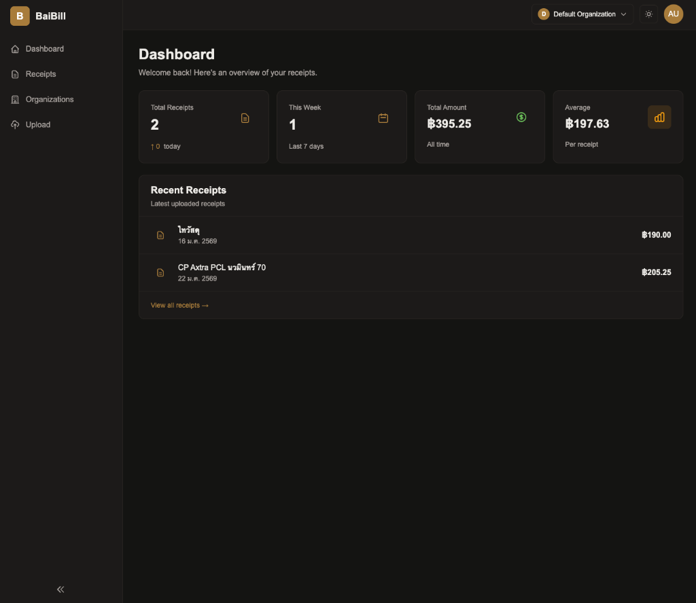

# 🧾 Receipt OCR (BaiBill)

<div align="center">




**A modern, self-hosted receipt management system with powerful OCR capabilities**

[Features](#-features) • [Demo](#-demo) • [Quick Start](#-quick-start) • [Documentation](#-documentation) • [Troubleshooting](#-troubleshooting)

</div>

---

## 📖 About

BaiBill is a production-ready, self-hosted application that automates receipt management through intelligent optical character recognition (OCR). Built with modern technologies and designed for businesses and individuals who need to digitize, organize, and analyze their receipts efficiently.

### 🎯 Target Users

- **Small Businesses** - Track expenses, manage receipts, and generate reports
- **Accountants & Bookkeepers** - Centralize client receipt management
- **Freelancers** - Organize business expenses for tax purposes
- **Finance Teams** - Automate receipt processing workflows
- **Anyone** - Who wants to go paperless with their receipts

### 💡 Why BaiBill?

- **Privacy First**: Self-hosted solution - your data stays on your servers
- **No Subscription Fees**: One-time setup, no recurring costs
- **Accurate OCR**: Powered by advanced AI models (Google Cloud Vision or OpenAI)
- **Multi-Organization**: Support for teams and multiple organizations
- **Open Source**: Fully transparent, customizable, and community-driven

---

## ✨ Features

### Core Functionality

- 🤖 **Intelligent OCR Processing**
  - Automatic text extraction from receipt images
  - Support for multiple OCR providers (GCP Vision, OpenAI GPT-4 Vision)
  - Extracts merchant name, date, items, prices, taxes, and totals
  - Handles multiple currencies and formats

- 📊 **Receipt Management**
  - Upload receipts via web interface
  - View detailed receipt information
  - Search and filter receipts
  - Export data to Excel/CSV

- 📈 **Analytics & Reporting**
  - Real-time dashboard with statistics
  - Total spending tracking
  - Average receipt amount analysis
  - Time-based reporting (daily, weekly, monthly)

- 👥 **Multi-Organization Support**
  - Create and manage multiple organizations
  - Role-based access control (Admin, Member)
  - Invite users via email
  - Switch between organizations seamlessly

- 🔐 **Security & Authentication**
  - JWT-based authentication
  - Email verification
  - Secure password hashing (bcrypt)
  - Environment-based configuration
  - CORS protection

- 🐳 **Production-Ready Deployment**
  - Docker Compose setup included
  - Nginx reverse proxy with security headers
  - Rate limiting and DDoS protection
  - Health checks and monitoring
  - SSL/HTTPS support

### Technical Features

- **Modern Tech Stack**: Next.js 15, NestJS, TypeScript, PostgreSQL
- **Type Safety**: End-to-end type safety with shared DTOs
- **Monorepo Architecture**: Organized workspace structure
- **RESTful API**: Well-documented API with Swagger/OpenAPI
- **Database Migrations**: TypeORM with versioned migrations
- **Responsive Design**: Mobile-first UI with Tailwind CSS
- **Dark Mode**: Built-in dark theme support

---

## 🚀 Quick Start

### Prerequisites

- **Node.js** >= 20.0.0
- **npm** >= 10.0.0
- **Docker** & **Docker Compose** (for containerized deployment)
- **OCR Provider Account**:
  - [Google Cloud Platform](https://cloud.google.com/vision) (Vision API), OR
  - [OpenAI](https://platform.openai.com/) (GPT-4 Vision)

### Option 1: Docker Deployment (Recommended)

```bash
# 1. Clone the repository
git clone https://github.com/t-Oil/baibill.git
cd receipt-ocr

# 2. Run the start script
./docker-start.sh
```

Follow the interactive prompts to set up your environment variables.

### Option 2: Manual Docker Compose

```bash
# 1. Set up environment variables
cp .env.docker.example .env

# 2. Update .env with your credentials
nano .env

# 3. Start services
docker-compose up -d --build

# 4. Run migrations
docker-compose exec api npm run migration:run
```

Access the application:
- Frontend: `http://localhost`
- API Docs: `http://localhost/api/docs`

---

## 🔧 Troubleshooting

### Common Issues

#### 1. "Process Not Working" or Health Checks Failing

If the containers are restart looping or health checks are failing:

- **Check Logs**: Run `docker-compose logs -f api` or `docker-compose logs -f frontend` to see the error.
- **Database Connection**: Ensure the `postgres` container is healthy. The API waits for it.
- **Memory Issues**: If you see `ResourceExhausted` or exit code 137, your Docker VM might need more memory. Try increasing Docker Desktop memory limit to at least 4GB.

#### 2. OCR Not Working

- **Invalid Credentials**: Check your `GOOGLE_APPLICATION_CREDENTIALS` path or `OPENAI_API_KEY`.
- **API Enabled**: Ensure the Vision API is enabled in your Google Cloud Console.

#### 3. "Self Signed Certificate" Error

For local development, ignore SSL warnings. For production, replace the certificates in `nginx/ssl/` with valid ones from Let's Encrypt.

---

## 📚 Documentation

- **[Docker Deployment Guide](README.docker.md)** - Complete guide for production deployment
- **[API Documentation](http://localhost/api/docs)** - Interactive Swagger API docs (when running)
- **[Contributing Guide](CONTRIBUTING.md)** - How to contribute to the project
- **[Changelog](CHANGELOG.md)** - Version history and updates

---

## 🤝 Contributing

We welcome contributions! Please see our [Contributing Guide](CONTRIBUTING.md) for details.

---

## 📄 License

This project is licensed under the MIT License - see the [LICENSE](LICENSE) file for details.
